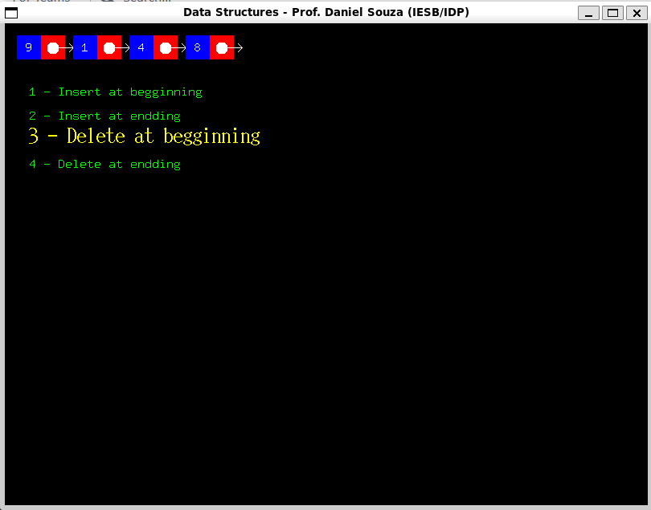
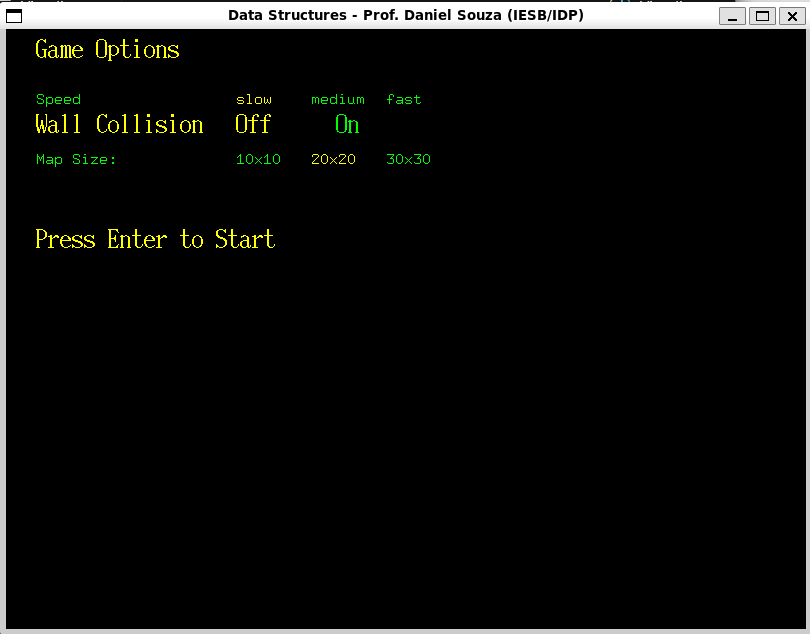
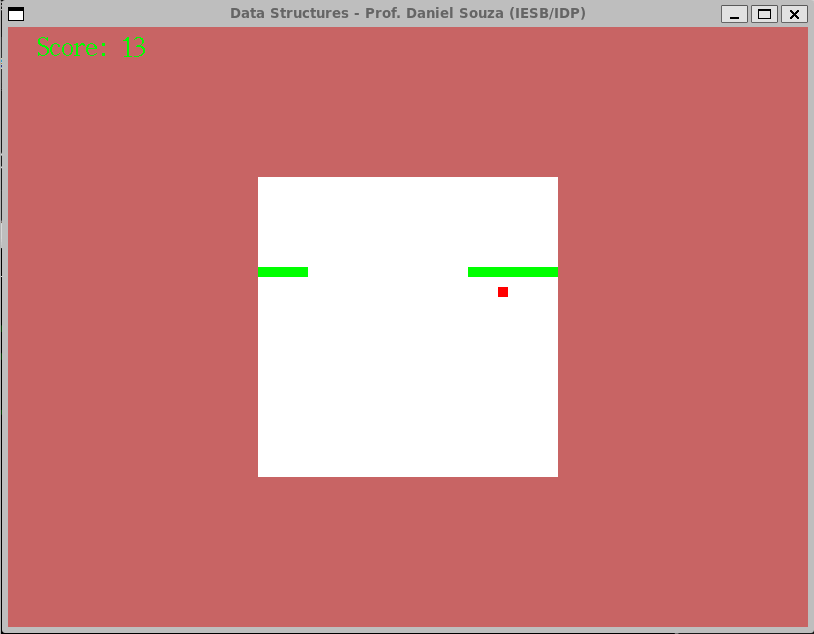
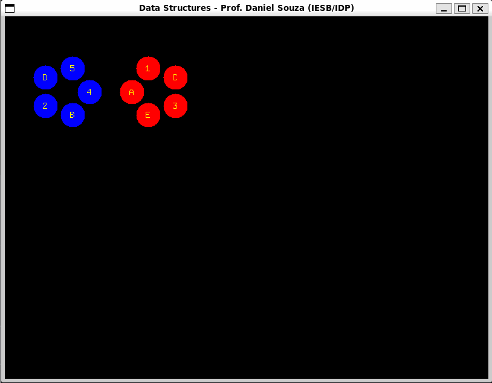

# Visual Data Structure App

## Overview
The Visual Data Structure App is an educational tool designed to aid students in learning data structures through a visual and interactive approach. This application is particularly beneficial for visual learners who can grasp concepts more effectively through graphical representations.

## Features

### Visual Operations with Linked List
- Demonstrates basic operations of linked lists, including insertion, deletion, and traversal.
- Interactive visualizations to help users understand the underlying processes of these operations.



### Games for Learning

#### Snake Game 
A classic game reimagined to teach the dynamics of data structures. In this version, the snake's body is represented as a linked list of nodes, where each node corresponds to a segment of the snake with a position `(x, y)`. The food in the game is also represented as a node. This game creates a direct and intuitive representation of linked list operations.

To start the game, you can provide some game preferences, as speed, wall collision and map size.



Here is an illustration of the game.



#### Find the Pattern
Utilizes two circular linked lists to challenge users in identifying patterns, enhancing their understanding of data structures in a fun and engaging way.



### Custom Graphics Library
Utilizes the X11 lib, specifically the simplified version provided by Douglas Thain, known as [`gfx`](http://www.nd.edu/~dthain/courses/cse20211/fall2013/gfx).
- This project extended `gfx` library with additional functions to enrich the graphical experience.

### Own Image Processing Library
Incorporates a custom-built image processing library, `pdi_img`, written in 2012, when I was a computer science student at IESB.
- Independent of third-party libraries, requiring only `stdlib` and `math`.
- All image processing code was manually written, demonstrating a deep understanding of the fundamentals of image processing.
- The image data structure used in this application is designed to be similar to that of OpenCV's image format. However, it enhances flexibility by allowing the manipulation of both color and grayscale images within a single data structure. This is made possible through the use of a union, which simplifies the handling of different image types.


## Getting Started

### Prerequisites
- Ensure you have a C compiler installed (e.g., GCC).
- X11 library must be installed for graphics functionalities. (Consider using Linux)

### Installation
1. Clone the repository:
```bash
git clone 
```
2. Navigate to the cloned directory:
```bash
cd Visual_Data_Structure
```
3. Compile the application:
```bash
make 
```

### Running the Application
- After compilation, run the application:
```bash
./visual_data_structure.app
```

## Usage

- Follow the on-screen instructions to explore different data structures and play games.
- Use the visual operations feature to interact with linked lists.
- Play the Snake Game and Pattern Finder to reinforce your understanding of data structures.

### Navigation Controls
- Use the `A`, `W`, `S`, and `D` keys or the arrow keys for navigation within the application.
- Press `ESC` to go back.
- Use the `Enter` key to select an option or confirm an action.

## Contributing
Contributions to the Visual Data Structure App are welcome. Please read `CONTRIBUTING.md` for details on our code of conduct, and the process for submitting pull requests to us.

## License
This project is licensed under the [LICENSE NAME] - see the `LICENSE` file for details.

## Acknowledgments
- Douglas Thain for the `gfx` library.
- All contributors who have helped to enrich this educational tool.